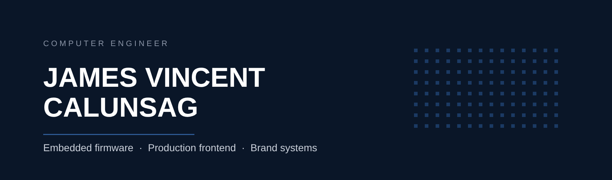
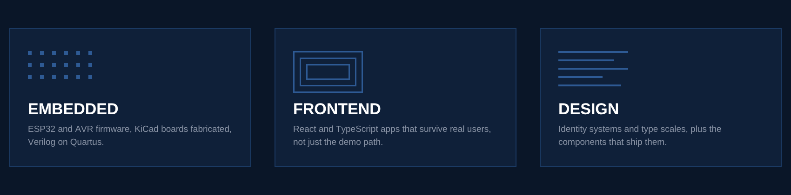
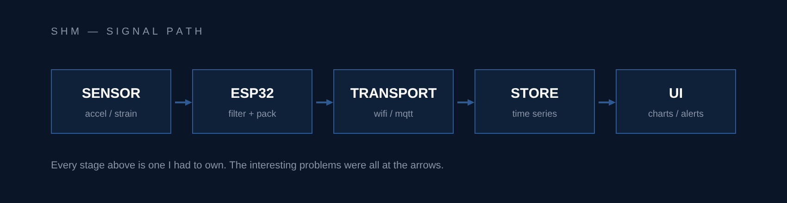

<!-- =====================================================================
     PROFILE README — monochrome + dark blue

     Palette. Nothing outside this set; no second hue anywhere. Semantic
     signals (availability, project surface) are carried by VALUE and
     FORM, never by colour.

       #0A1628  ground          deep navy
       #0F2039  raised panel
       #1B3A63  mid navy        rules, quiet chips
       #2E5A94  accent navy     arrows, active chips
       #8A94A6  grey            blue-biased, secondary text
       #C9CFD9  light grey
       #FFFFFF  white           primary text on navy

     Graphics. assets/*.png are authored, not stock: built via the Canva
     MCP with add_page + insert_shape + add_text at the exact hexes above,
     then exported at native size. They are COMMITTED FILES, deliberately.
     Third-party render services (capsule-render, github-readme-stats,
     github-profile-trophy, activity-graph) all sit on shared over-quota
     Vercel instances — several already answer 402/503 — and a markdown
     image that fails renders as a broken-image icon. Committed PNGs have
     no such dependency. Total weight is ~95 KB for all three.

     Two constraints worth remembering before editing:
       - GitHub strips <style> and style="". There is no CSS here: no
         borders, shadows or gradients that are not baked into a PNG.
       - 
 is the only clickable element the sanitiser keeps, so
         it carries all the interaction. Everything important stays
         readable with every accordion shut.

     Canva source design: "tengkyuuu README graphics" (4 pages; page 1 is
     an unused 851x315 scratch canvas). Re-export at native size — custom
     width/height export is refused on this plan and fails with a
     misleading "not allowed to access design" error.
     ===================================================================== -->

  

  
  <!-- No logo= on the LinkedIn and Adobe chips: simple-icons dropped those
       glyphs over trademark policy, and shields silently renders nothing for
       an unknown slug. Text-only here is deliberate, not an oversight. -->
  
  
  

  
  
  
  

I work where hardware meets software: ESP32 firmware and fabricated PCBs on one side,
production React and brand systems on the other. I think from the silicon up and still
care about the surface people actually touch.

**Dapitan City, Philippines** (UTC+8) &nbsp;·&nbsp; **BS Computer Engineering** &nbsp;·&nbsp;
building [**Portfolio.docx**](https://engrjamescalunsag.vercel.app/), a portfolio that
behaves like a Word document &nbsp;·&nbsp; open to freelance, internships and collaborations.

---

## Three domains, one engineer

  

<b>EMBEDDED</b> &nbsp;·&nbsp; ESP32, Arduino, Verilog, C/C++, PCB design

 

  
  
  <!-- intel, not xilinx: the FPGA work here is Quartus (see quartus-fpga-bcd),
       and shields ships no xilinx glyph anyway. -->
  
  
  

Firmware in C and C++ on ESP32 and AVR, boards drawn in KiCad and actually fabricated,
RTL in Verilog on Quartus. Wi-Fi and BLE transport, sensor conditioning, and the
unglamorous power budgeting that decides whether a deployment survives a month.

<b>FRONTEND</b> &nbsp;·&nbsp; React, TypeScript, Tailwind, Flutter, Three.js

 

  
  
  
  
  

Comfortable owning a frontend end to end: routing, state, forms, data fetching,
accessibility, and the build. Flutter for mobile when one codebase is the right call
rather than the lazy one.

<b>DESIGN</b> &nbsp;·&nbsp; Figma, Framer, Photoshop, Illustrator

 

  
  
  <!-- Adobe chips are text-only for the same trademark reason as LinkedIn. -->
  
  

Identity systems, type scales, and tokens — then the components that implement them,
so the handoff is a commit instead of a PDF.

<b>BACKEND &amp; TOOLS</b> &nbsp;·&nbsp; Node, Python, Firebase, Supabase, Git, Linux

 

  
  
  
  
  
  

Enough backend to keep a device fleet fed: auth, realtime, storage, scheduled jobs,
and Python for the data wrangling that lives between the sensor and the chart.

---

## Selected work

| Project | What it is | Surface |
| :--- | :--- | :--- |
| **SHM** | Structural health monitoring — IoT sensors through to dashboard | `EMBEDDED` `WEB` |
| **Stormfresh** | Poultry ERP running on a working farm | `WEB` |
| **Physiopaño** | Mobile app plus an admin web portal | `MOBILE` `WEB` |
| **Rallys Equities** | Company site — brand and build | `BRAND` `WEB` |
| **MYKTECH** | Software studio website | `WEB` |
| **FameCRM** | CRM frontend | `WEB` |

  

SHM is the one to ask about. It is where the whole thesis holds up: a device that has to
stay alive unattended, a link that will drop, and a dashboard someone non-technical has
to trust. Full write-ups, with the constraints and what broke, live on
[**engrjamescalunsag.vercel.app**](https://engrjamescalunsag.vercel.app/).

<b>How I work</b>

 

- Read the datasheet before the tutorial.
- Reach for the scope before the print statement.
- Types at the boundary, freedom in the middle.
- Ship the thin vertical slice, then widen it.
- If it cannot be measured, it is not done.

Repos here are a mix of coursework, hardware experiments, and client work I could
open-source. The interesting failures are written up in the individual READMEs.

<b>If you are hiring</b>

 

| Need | What I actually do |
| :--- | :--- |
| **Device to dashboard** | Sensor firmware, transport, API, and the UI that reads it — one person, no handoff seams |
| **Frontend that ships** | React and TypeScript apps that survive real users, not just the demo path |
| **Brand and build** | Identity plus the site it lives on, so the design and the code never drift apart |

Freelance, internship and collaboration are all open. UTC+8, which overlaps EU mornings
and US evenings. Fastest path: [email me](mailto:jamescalunsag13@gmail.com) with the
constraint you are stuck on.

---

## The numbers

<!-- Two sources per card so the stats stay legible on both GitHub themes.
     A single fixed theme is unreadable on one of them. -->

  <picture>
    <source media="(prefers-color-scheme: dark)" srcset="https://streak-stats.demolab.com?user=tengkyuuu&hide_border=true&background=00000000&ring=2E5A94&fire=2E5A94&currStreakLabel=C9CFD9&sideLabels=C9CFD9&dates=8A94A6" />
    
  </picture>

<!-- ---------------------------------------------------------------------
     The stats and top-languages cards are deliberately NOT here.

     github-readme-stats.vercel.app, github-profile-trophy.vercel.app and
     github-readme-activity-graph.vercel.app were all checked on
     2026-09-09: the first returns 503 on every request and the other two
     return 402, over their Vercel quota. Everyone points at those same
     shared instances, so they are chronically out of budget. A markdown
     image that 503s renders as a broken-image icon, which looks worse on
     a profile than having no card at all.

     The fix is to run your own instance, which you already have Vercel
     for. It takes about five minutes:

       1. Fork  https://github.com/anuraghazra/github-readme-stats
       2. Import the fork on Vercel and deploy it
       3. Add a PAT (no scopes needed) as PAT_1 in its env vars
       4. Swap the host below and uncomment

     Your own instance has your own rate limit, so it stops breaking.
     The colours below are already on-palette: 2E5A94 titles on dark,
     1B3A63 on light, greys from the token set at the top of this file.

  <picture>
    <source media="(prefers-color-scheme: dark)" srcset="https://YOUR-INSTANCE.vercel.app/api?username=tengkyuuu&show_icons=true&hide_border=true&bg_color=00000000&title_color=2E5A94&text_color=C9CFD9&icon_color=2E5A94" />
    
  </picture>
  <picture>
    <source media="(prefers-color-scheme: dark)" srcset="https://YOUR-INSTANCE.vercel.app/api/top-langs/?username=tengkyuuu&layout=compact&hide_border=true&bg_color=00000000&title_color=2E5A94&text_color=C9CFD9" />
    
  </picture>

     --------------------------------------------------------------------- -->

---

## Say hello

Bring me a constraint, not a spec sheet. The constraint is where the engineering is.

  
  
  

Adaptability is the engineering skill.

