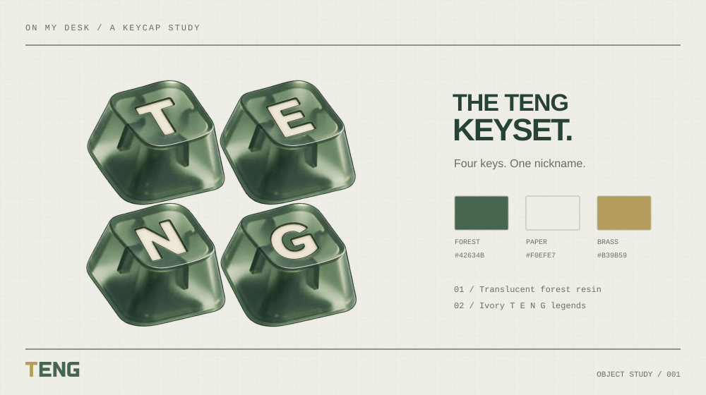

<!-- Static, self-contained SVG artwork. Rebuild with: python scripts/build_assets.py
     Forest green / drafting paper / muted brass. Custom TENG wordmark and resin keyset.
     Interaction uses GitHub's native links and expandable details. -->

<picture>
  <source media="(max-width: 600px)" srcset="assets/hero-mobile.svg" />
  
</picture>

  &nbsp;
  &nbsp;
  

  <a href="#the-toolkit">The toolkit</a> &nbsp; / &nbsp;
  <a href="#selected-work">Selected work</a> &nbsp; / &nbsp;
  <a href="#behind-the-build">Behind the build</a> &nbsp; / &nbsp;
  <a href="#lets-build-something">Let's talk</a>

 

I’m **James**, but you can call me **Teng** — a computer engineer focused on software. I build web and mobile applications, turn data into useful interfaces, and give the whole thing a considered visual identity. I also have an interest in networking and how systems communicate.

**Dapitan City, Philippines · UTC+8 · BS Computer Engineering** 
Open to **freelance work, internships, and collaborations**.

 

## The toolkit

Three disciplines. One connected workflow. **Open a section to explore.**

<b>01 &nbsp; Frontend & mobile</b> — interfaces people use

 

`React` `TypeScript` `Tailwind CSS` `Flutter` `Three.js`

Interfaces from routing and state to forms, data fetching, accessibility, and the build. React and TypeScript for the web; Flutter for mobile.

**What I work on**

- Dashboards that make complex data understandable.
- Business applications, admin portals, and customer interfaces.
- Interactive experiences with a little personality.

[Explore frontend repositories ↗](https://github.com/tengkyuuu?tab=repositories&q=&type=&language=typescript&sort=)

<b>02 &nbsp; Application development</b> — the work behind the interface

 

`Node.js` `Python` `Firebase` `Supabase`

The services and data that make an application useful: authentication, storage, realtime updates, and the connections between them.

**What I work on**

- Connecting interfaces to APIs and application data.
- Authentication, database integration, and file storage.
- Python scripts for data processing and everyday automation.

[Explore my repositories ↗](https://github.com/tengkyuuu?tab=repositories)

<b>03 &nbsp; Visual design</b> — where the details come together

 

`Figma` `Framer` `Photoshop` `Illustrator`

Identity systems, typography, and reusable design tokens, followed by the components that put them into use.

**What I work on**

- Brand identities and websites built around them.
- Type scales, layouts, and interface systems.
- Taking a design through to its implementation.

[See design and development work ↗](https://jamescalunsag.online/)

<b>+ &nbsp; Tools & networking</b> — what keeps everything connected

 

`Git` `Linux`

Version control, the command line, and a little networking: understanding how applications communicate and finding where a connection breaks down.

 

## Selected work

 

| Project | What it does | Disciplines |
| :--- | :--- | :--- |
| **Stormfresh** | A poultry ERP running on a working farm | Web |
| **Physiopaño** | A mobile app and its admin web portal | Mobile · Web |
| **Rallys Equities** | A company website, from brand to build | Design · Web |
| **MYKTECH** | A software studio website | Web |
| **FameCRM** | A CRM frontend | Web |
| **SHM** | A structural health monitoring system with a dashboard for sensor data | IoT · Web |

<b>Explore SHM</b> — making monitoring data useful

 

SHM connects sensor data to a monitoring dashboard. Its software brings readings into storage and turns them into charts and alerts; Wi-Fi / MQTT carries the data between the device and the application.

| Stage | The work |
| :--- | :--- |
| **Sense** | Collect acceleration and strain readings. |
| **Process** | Filter and package the readings on an ESP32. |
| **Transmit** | Move device data over Wi-Fi / MQTT. |
| **Store** | Keep a time-series record. |
| **Understand** | Turn readings into charts and alerts. |

[Explore the project write-ups in my portfolio ↗](https://jamescalunsag.online/)

 

## Behind the build

<b>The Teng keyset</b> — a little personality on the desk

 

Four keys, one nickname. Translucent forest green keycaps with ivory letters spelling **TENG**, paired with warm paper and muted brass. A little desk inspiration, in the profile’s colors.

[View the keycap study](assets/keycaps.svg) &nbsp; · &nbsp; [View the Teng wordmark](assets/teng-logo.svg)

<b>How I approach a project</b>

 

- Understand the problem before choosing the stack.
- Make the interface clear and the code easy to follow.
- Put types at the boundaries.
- Ship a small working path through the whole system, then expand it.
- Measure what matters.

My repositories include coursework, software experiments, and client work I can share publicly.

[Browse the repositories ↗](https://github.com/tengkyuuu?tab=repositories) &nbsp; · &nbsp; [View contributions ↗](https://github.com/tengkyuuu?tab=overview)

<b>Have a role or a project in mind?</b>

 

| You need | I can help with |
| :--- | :--- |
| **A frontend that ships** | React and TypeScript applications, from interface design to implementation. |
| **An app that connects the pieces** | Web and mobile interfaces connected to authentication, APIs, and data. |
| **Brand and build** | A visual identity and the website that brings it to life. |

I'm open to freelance work, internships, and collaborations. Based in **UTC+8**, with overlap for EU mornings and US evenings.

[Tell me about your project ↗](mailto:jamescalunsag13@gmail.com?subject=Let%27s%20build%20something)

 

## Let's build something

Have an app to build, an interface to ship, or a website that needs a fresh identity? **I'd like to hear about it.**

**[Email me ↗](mailto:jamescalunsag13@gmail.com)** &nbsp; · &nbsp; [LinkedIn](https://www.linkedin.com/in/james-vincent-calunsag) &nbsp; · &nbsp; [Portfolio.docx](https://jamescalunsag.online/)

 

