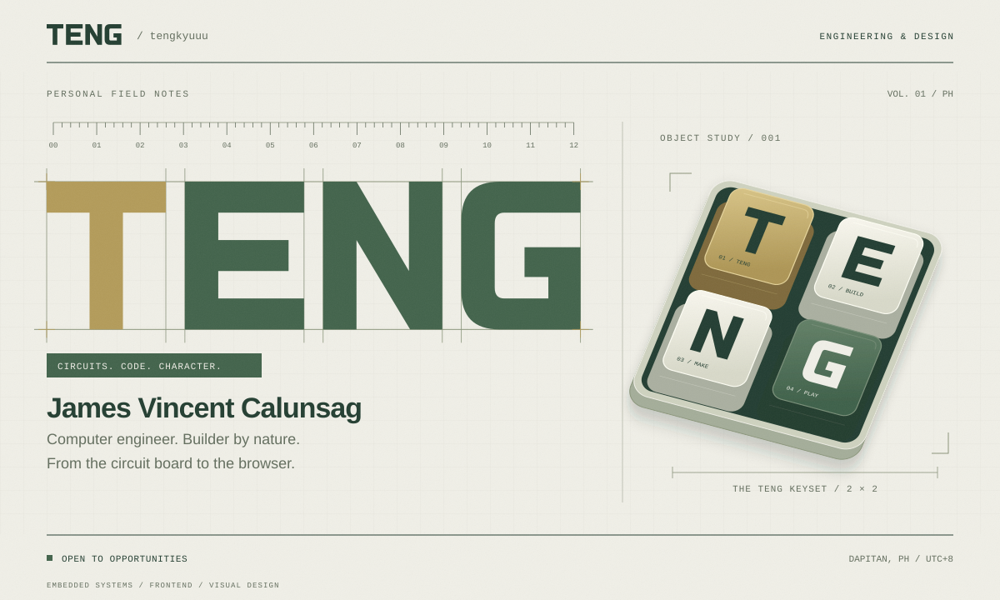
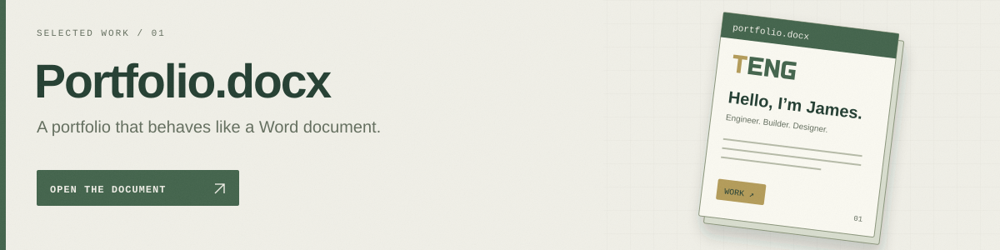
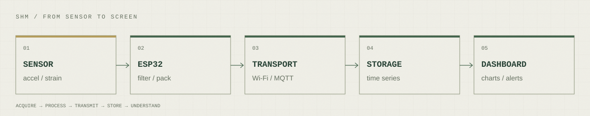
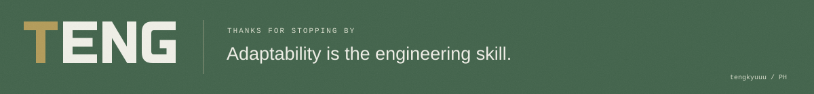

<!-- Graphics are local SVGs. Rebuild with: python scripts/build_assets.py
     Animation lives inside the images; interaction uses GitHub's native links and details.
     All artwork respects prefers-reduced-motion. -->

<picture>
  <source media="(max-width: 600px)" srcset="assets/hero-mobile.svg" />
  
</picture>

  &nbsp;
  &nbsp;
  

  <a href="#the-toolkit">The toolkit</a> &nbsp; / &nbsp;
  <a href="#selected-work">Selected work</a> &nbsp; / &nbsp;
  <a href="#behind-the-build">Behind the build</a> &nbsp; / &nbsp;
  <a href="#lets-build-something">Let's talk</a>

 

I’m **James**, a computer engineer who works from the circuit board to the browser. I build embedded systems, turn data into useful interfaces, and give the whole thing a considered visual identity.

**Dapitan City, Philippines · UTC+8 · BS Computer Engineering** 
Open to **freelance work, internships, and collaborations**.

 

## The toolkit

Three disciplines. One connected workflow. **Open a section to explore.**

<b>01 &nbsp; Embedded systems</b> — where the signal starts

 

`ESP32` `Arduino / AVR` `C / C++` `Verilog / Quartus` `KiCad`

Firmware, fabricated PCBs, and the connections between them. I work with Wi-Fi and BLE, sensor conditioning, and power budgets that matter once a device leaves the desk.

**What I work on**

- Sensor acquisition and firmware on ESP32 and AVR.
- PCB design in KiCad, through to fabrication.
- Digital logic in Verilog using Quartus.

[Explore hardware repositories ↗](https://github.com/tengkyuuu?tab=repositories&q=&type=&language=c%2B%2B&sort=)

<b>02 &nbsp; Frontend engineering</b> — where the signal becomes useful

 

`React` `TypeScript` `Tailwind CSS` `Flutter` `Three.js`

Interfaces from routing and state to forms, data fetching, accessibility, and the build. React and TypeScript for the web; Flutter for mobile.

**What I work on**

- Dashboards that make device data understandable.
- Business applications, admin portals, and customer interfaces.
- Interactive experiences with a little personality.

[Explore frontend repositories ↗](https://github.com/tengkyuuu?tab=repositories&q=&type=&language=typescript&sort=)

<b>03 &nbsp; Visual design</b> — where the details come together

 

`Figma` `Framer` `Photoshop` `Illustrator`

Identity systems, typography, and reusable design tokens, followed by the components that put them into use.

**What I work on**

- Brand identities and websites built around them.
- Type scales, layouts, and interface systems.
- Taking a design through to its implementation.

[See design and development work ↗](https://engrjamescalunsag.vercel.app/)

<b>+ &nbsp; The supporting tools</b> — what keeps everything connected

 

`Node.js` `Python` `Firebase` `Supabase` `Git` `Linux`

Authentication, realtime data, storage, scheduled jobs, and Python for the data wrangling between a sensor and a chart.

 

## Selected work

 

| Project | What it does | Disciplines |
| :--- | :--- | :--- |
| **SHM** | Structural health monitoring, from IoT sensors to a dashboard | Embedded · Web |
| **Stormfresh** | A poultry ERP running on a working farm | Web |
| **Physiopaño** | A mobile app and its admin web portal | Mobile · Web |
| **Rallys Equities** | A company website, from brand to build | Design · Web |
| **MYKTECH** | A software studio website | Web |
| **FameCRM** | A CRM frontend | Web |

<b>Explore SHM</b> — follow a reading from sensor to screen

 

SHM brings my work together: a device that needs to run unattended, a connection that can drop, and a dashboard that someone can rely on.

| Stage | The work |
| :--- | :--- |
| **Sense** | Collect acceleration and strain readings. |
| **Process** | Filter and package the readings on an ESP32. |
| **Transmit** | Move device data over Wi-Fi / MQTT. |
| **Store** | Keep a time-series record. |
| **Understand** | Turn readings into charts and alerts. |

[Explore the project write-ups in my portfolio ↗](https://engrjamescalunsag.vercel.app/)

 

## Behind the build

<b>How I approach a project</b>

 

- Read the datasheet before the tutorial.
- Reach for the scope before the print statement.
- Put types at the boundaries.
- Ship a small working path through the whole system, then expand it.
- Measure what matters.

My repositories include coursework, hardware experiments, and client work I can share publicly.

[Browse the repositories ↗](https://github.com/tengkyuuu?tab=repositories) &nbsp; · &nbsp; [View contributions ↗](https://github.com/tengkyuuu?tab=overview)

<b>Have a role or a project in mind?</b>

 

| You need | I can help with |
| :--- | :--- |
| **Device to dashboard** | Sensor firmware, transport, and the interface that makes the data useful. |
| **A frontend that ships** | React and TypeScript applications, from interface design to implementation. |
| **Brand and build** | A visual identity and the website that brings it to life. |

I'm open to freelance work, internships, and collaborations. Based in **UTC+8**, with overlap for EU mornings and US evenings.

[Tell me about your project ↗](mailto:jamescalunsag13@gmail.com?subject=Let%27s%20build%20something)

 

## Let's build something

Have a board to bring up, an interface to ship, or an idea that needs both? **I'd like to hear about it.**

**[Email me ↗](mailto:jamescalunsag13@gmail.com)** &nbsp; · &nbsp; [LinkedIn](https://www.linkedin.com/in/james-vincent-calunsag) &nbsp; · &nbsp; [Portfolio.docx](https://engrjamescalunsag.vercel.app/)

 

